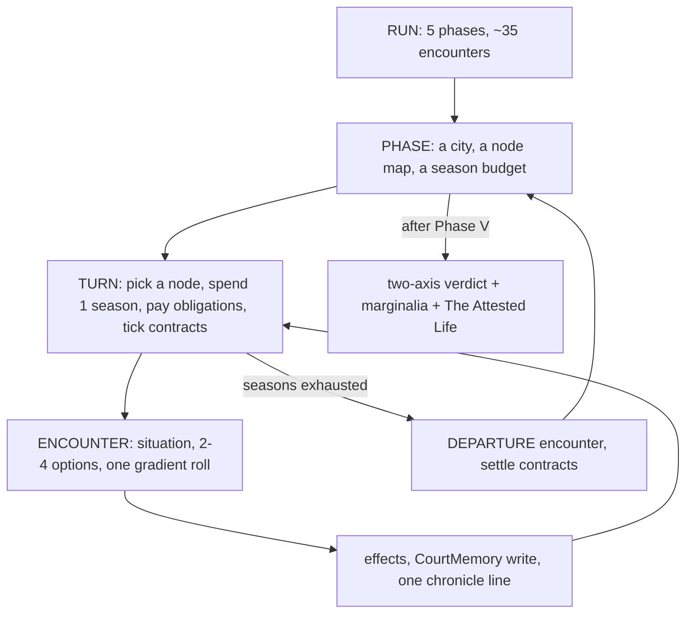

# GAMELOOP.md — The Loop, As Built

**Written 2026-08-31.** Companion to [SYSTEMS.md](SYSTEMS.md), which is the *spec*. This
file is the **as-built**: what the code in `src/` and `content/` actually does when
someone plays it, measured rather than recalled.

Every number here is reproducible:

```bash
node tools/analyze-content.mjs        # static: pools, gates, reachability, prose, lexicon
node tools/simulate-runs.mjs 2000     # dynamic: 2000 complete runs through the real engine
```

The three companion documents each take one layer of this apart:
[MECHANICSISSUES.md](MECHANICSISSUES.md) (what is broken),
[ECONOMY.md](ECONOMY.md) (the numbers),
[ENCOUNTERSNEXTSTEP.md](ENCOUNTERSNEXTSTEP.md) (the content),
[WRITINGAUDIT.md](WRITINGAUDIT.md) (the prose).

---

## 1. The four nested loops



**The turn is the atom** and it is very small: choose a node, read 3–4 sentences, pick one
of 2–4 options, watch a weighted roll, read two more sentences, take one chronicle line.
Measured: a run is **31 encounters at the median** (`simulate-runs.mjs`), so a full
playthrough is roughly thirty of these. That is the whole game.

## 2. What one turn actually costs and does

| Step | Where | What actually happens |
|---|---|---|
| Node choice | `main.js:enterNode` | Player picks any node whose pool still has an eligible encounter |
| Time | `main.js` | Flat **−1 season**. `opt.time` exists in the engine and is used by **0 options** |
| Obligations | `career.js:chargeObligations` | Charged per action. Exactly **one obligation exists** (the judgeship, Phase II, cost 1) |
| Contracts | `career.js:tickContracts` | Deadlines tick. Exactly **one encounter** in the game opens a contract |
| Draw | `engine.js:drawEncounter` | **First eligible encounter in the node's array order.** No randomness anywhere |
| Options | `engine.js:evaluateOptions` | Requirements → `unlockedBy` / `lockedBy`; boosts → `favoredBy` |
| Resolve | `engine.js:resolveOption` | Weighted pick over the option's bands; met boosts multiply the top two bands by `1 + favoredBy.length` |
| Record | `state.js:applyEffects` | Meter/rep/quintet deltas, memory writes, one chronicle line, one run-log entry |

**The draw is deterministic.** This is the single most consequential fact about the loop
and it is not written down anywhere else. A node is an *ordered queue*, not a pool: visit
"The Tribunal" in Phase V and you get `trial_first`, then `trial_second`, then
`trial_third`, in that order, every run. Variety comes entirely from *which* nodes a player
visits and how often — never from the draw.

That has one good consequence and two bad ones. The good one: it gives designers a free
sequencing tool, and Phase V's three inquisitions genuinely use it. The bad ones are
[MECHANICSISSUES.md](MECHANICSISSUES.md) §3 (positional starvation) and §4 (replay
overlap at 57% against a stated target of <40%).

## 3. The run, measured

Random play, 2000 runs:

| | P1 Cairo | P2 Isfahan | P3 Courts | P4 Pivot | P5 Trials |
|---|---|---|---|---|---|
| Seasons | 7 | 8 | 9 | 6 | 7 |
| Encounters authored | 14 | 14 | 16 | 13 | 13 |
| Seen per run | 8.0 | 7.9 | 7.9 | **4.6** | 6.4 |
| Share of pool seen | 57% | 56% | 50% | **35%** | 49% |
| Median synthesis after | 2 | 5 | 8 | **10** | 10 |
| Median exposure after | 2 | 3 | 5 | 6 | 7 |

Half the corpus goes unseen per run, which is the intended design. But the *same* half
tends to go unseen, because the draw is deterministic and node pools are ordered:
successive runs overlap **57%** of their encounters.

## 4. Where the loop's promises are and are not kept

SYSTEMS.md makes six structural promises. Measured:

| Promise | Status |
|---|---|
| Options gated on capability × affordance, with visible provenance | **Kept.** 65 gated options, all render `unlockedBy`/`lockedBy` |
| Every encounter has ≥1 free option | **Kept.** 0 violations |
| Every encounter has ≥1 capability-gated option | **Broken.** 24 of 70 encounters (34%) have no gated option at all |
| Gradient outcomes, six steps, never pass/fail | **Half kept.** 108 of 201 options have exactly one outcome — no roll |
| Exposure compounds and gates escalating pressure | **Kept in direction, broken in scale** — see [ECONOMY.md](ECONOMY.md) §3 |
| Obligations and contracts make it a *career* | **Barely built.** One obligation, one contract encounter, in a five-phase game |
| Any memory written is read later | **Kept, but almost entirely at the ending** — 148 flags written, 24 read by a gate, 8 read across a phase boundary |

## 5. The shape of the problem

The loop is real and the parts are well made. What is missing is *pressure between the
parts*. Three of the four things that should compete for a season — the office, the
patron's deadline, the book — exist as one encounter each. So a turn is almost always a
free choice among pleasant options, and the strategic question SYSTEMS.md names as "the
Career part of the Career Sim" —

> *serve the office, the patron, the book, the students, or the network?*

— is asked, in a full run, roughly twice.

The single highest-leverage change is not more encounters. It is **making the existing
turn cost something**: obligations in every phase, contracts that overlap, and a season
budget tight enough that a node visit forecloses another. [ECONOMY.md](ECONOMY.md) §5
proposes specific numbers; [ENCOUNTERSNEXTSTEP.md](ENCOUNTERSNEXTSTEP.md) §4 proposes the
content that carries them.

## 6. Vocabulary for the other documents

- **Draw order** — position in a node's `encounters` array. Position 1 fires ~99% of the
  time; position 5+ effectively never fires.
- **Dead gate** — a requirement no reachable state can satisfy. There are 9.
- **Deterministic option** — an option with exactly one outcome band. There are 108.
- **Retrospective memory** — a flag read only by the ending's marginalia, never by a
  later encounter. 124 of 148 flags are retrospective.
- **Saturated meter** — one that reaches its cap before the run ends and stops carrying
  information. Synthesis saturates in 83% of runs, usually during Phase IV.
