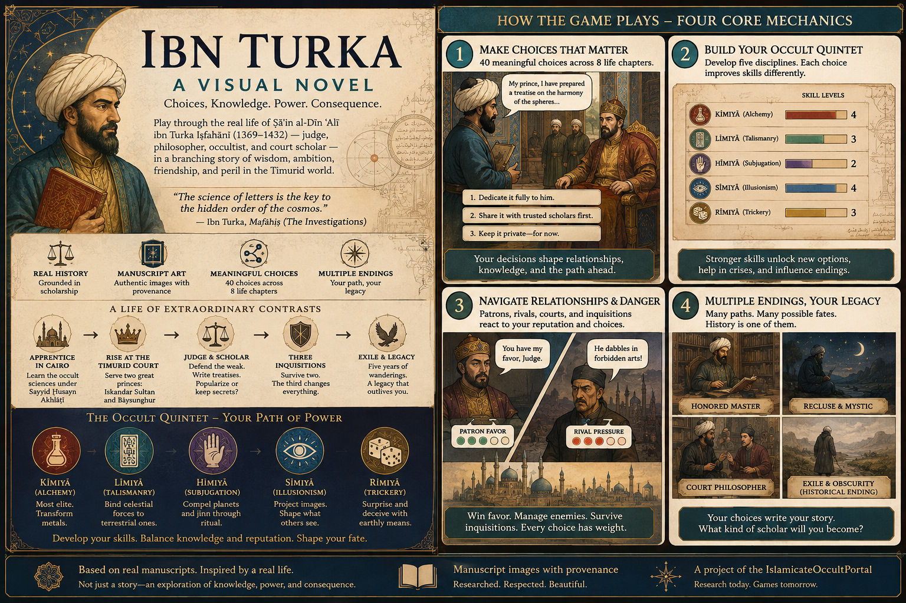

# TurkaGame

**🔗 Live site: [t3dy.github.io/TurkaGame](https://t3dy.github.io/TurkaGame/)** — includes a
[playable visual-novel prototype](https://t3dy.github.io/TurkaGame/games/visual-novel/index.html).

Games and a research pipeline built on **Ṣāʾin al-Dīn ʿAlī ibn Turka Iṣfahānī**
(1369–1432), Chief Judge of Isfahan and the foremost occult philosopher of Timurid
Iran — sourced from extant manuscripts and real scholarship, not invented fantasy.



## What's playable right now

A **CYOA/RPG-hybrid visual novel prototype**: 40 branching choices across 8 acts of
Ibn Turka's life, a five-branch skill tree (the real, period-named "Occult Quintet"
of occult sciences), gates where an early decision concretely closes off a later
option, and several distinct computed endings — the historical outcome (exile, death
in 1432) is one ending among several, not privileged over the others.

▶ **[Play it](https://t3dy.github.io/TurkaGame/games/visual-novel/index.html)**

The scene text is real prose, not filler, but it's still an early pass — see
[NEXTSTEPS.md](NEXTSTEPS.md) for what's next.

## Three prototypes

- **Visual novel** — *in active development, playable prototype above.* Episodes of
  Ibn Turka's life told through the choices in
  [games/visual-novel/CHOICES.md](games/visual-novel/CHOICES.md), each tagged for how
  grounded it is in the historical record (ATTESTED / PLAUSIBLE-GAP /
  INVENTED-COMPATIBLE).
- **Roguelike** — *design stage.* Built on the same Occult Quintet hierarchy, in the
  vein of this workspace's other Atalanta-Fugiens-based roguelikes. See
  [docs/GAME_ROGUELIKE.md](docs/GAME_ROGUELIKE.md).
- **Esoteric scholar career sim** — *design stage.* Skill-tree progression through the
  occult sciences, patron relationships, court politics, and the Islamicate economy
  Ibn Turka actually operated in. See [docs/GAME_CAREER_SIM.md](docs/GAME_CAREER_SIM.md).

## Research grounding

Nothing here is invented fantasy dressing. [docs/RESEARCH_BRIEF.md](docs/RESEARCH_BRIEF.md)
synthesizes three papers by Matthew Melvin-Koushki (University of South Carolina),
the leading scholar of Ibn Turka and the Islamicate occult sciences. A sibling
project, **IslamicateOccultPortal** (local only, not yet on GitHub), is the broader
digital-humanities research home this game draws from — lettrism, the Brethren of
Purity, Ahmad al-Buni's talismanic corpus — with a 552-image research catalog.

Manuscript and diagram imagery in the game itself is sourced with explicit,
per-image provenance in [assets/manuscripts/registry.json](assets/manuscripts/registry.json)
(institution, rights, source URL) — see
[assets/schema/asset-provenance.schema.json](assets/schema/asset-provenance.schema.json)
for the schema every image is checked against before it's used.

## Project structure

```
TurkaGame/
├── docs/                      design docs, research brief, decisions log
├── research/
│   ├── library/                (gitignored) source PDFs — local only, never committed
│   ├── notes/                   per-source synthesis notes
│   └── scripts/register_asset.py   asset-provenance CLI — add/list/approve/check
├── assets/
│   ├── manuscripts/             curated images + registry.json (provenance records)
│   └── schema/                    asset-provenance.schema.json
├── games/
│   ├── visual-novel/            playable prototype — CHOICES.md, STATE_MODEL.md,
│   │                              choices.json, js/ engine
│   ├── roguelike/                 design doc only
│   └── career-sim/                design doc only
└── site/                      showcase website (this repo's GitHub Pages source)
```

## Running locally

No build step anywhere in this repo.

```bash
python -m http.server 7521
# then open http://localhost:7521/site/index.html
# or the game directly: http://localhost:7521/games/visual-novel/index.html
```

To add a new manuscript image to the game:

```bash
python research/scripts/register_asset.py add \
  --file path/to/image.jpg --title "..." --institution "..." \
  --rights-note "..." --source-url "..."
```

## Status & what's next

- [HANDOVER.md](HANDOVER.md) — current state for a fresh session to read first:
  what's built, what's verified, and the honest gaps.
- [NEXTSTEPS.md](NEXTSTEPS.md) — prioritized roadmap from a narrative-design pass.
- [GAMELOOP.md](GAMELOOP.md) — how the play loop actually works, act by act.
- [docs/DECISIONS.md](docs/DECISIONS.md) — the full decisions log, from kickoff
  through the mechanics and asset-sourcing choices.
- [CONVO1.md](CONVO1.md) — full kickoff-conversation record (read by section, not
  end to end — see its own header for why).

## License / provenance note

This is a personal research and game-design project, not a commercial release.
Manuscript images are used under the rights terms recorded per-image in
`assets/manuscripts/registry.json` (mostly public domain / Creative Commons via
Wikimedia Commons and Princeton University Library). The two pitch-overview images
in `site/images/` are concept art for this project, not manuscript reproductions.
